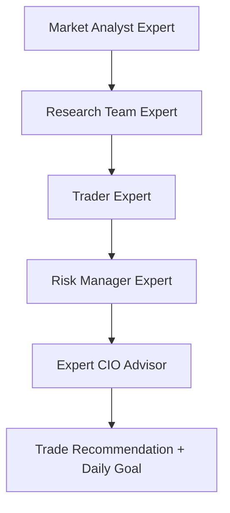

# Super Investment Agent

Expert multi-agent system to help you invest in the **US stock market**, with a default objective of **$1,000 USD daily profit** tracking, disciplined risk controls, and actionable trade plans.

> **Disclaimer:** Educational analysis only — not financial advice. Markets involve risk of loss. No system can guarantee daily profits.

## Architecture

Inspired by production patterns from [TradingAgents](https://github.com/Mai0313/TradingAgents), LangGraph multi-agent workflows, and institutional risk frameworks (position sizing, circuit breakers, min risk/reward).



### Expert agent team

| Agent | Role | Expertise |
|-------|------|-----------|
| **Market Analyst** | Senior Market Analyst | Technical analysis, RSI, MACD, SMAs, ATR |
| **Research Team** | Head of Equity Research | Bull/bear debate, fundamentals, news |
| **Trader** | Senior Equity Trader | Entry, target, stop, signal |
| **Risk Manager** | Chief Risk Officer | 1% risk/trade, 5% daily loss limit, R:R gate |
| **Expert CIO** | Chief Investment Officer | Final synthesis + optional LLM reasoning |

## Daily $1,000 goal

The agent maps your target to **required daily return** on your capital:

| Your capital | Required daily % for $1,000 |
|-------------|------------------------------|
| $100,000 | 1.0% |
| $200,000 | 0.5% |
| $50,000 | 2.0% (very aggressive) |

Configure via `.env`:

```bash
DAILY_PROFIT_TARGET_USD=1000
PORTFOLIO_CAPITAL_USD=100000
MAX_RISK_PER_TRADE_PCT=1.0
MAX_DAILY_LOSS_PCT=5.0
MIN_RISK_REWARD_RATIO=1.5
```

## Quick start

```bash
pip install -e ".[dev]"
cp .env.example .env

# Analyze a stock
invest-agent analyze AAPL

# Daily goal feasibility
invest-agent goal

# Scan watchlist
invest-agent scan --tickers "AAPL,NVDA,MSFT,GOOGL" --top 3

# Momentum rankings
invest-agent momentum

# JSON output
invest-agent analyze NVDA --json
```

### Optional LLM enhancement

Set `OPENAI_API_KEY` in `.env` to enable the **Expert CIO** LLM synthesis layer. The system works fully without it using rule-based expert logic.

## Programmatic usage

```python
from investment_agent import SuperInvestAgent

agent = SuperInvestAgent()
plan = agent.analyze("NVDA")
print(plan.recommendation.signal, plan.recommendation.confidence)
print(plan.expert_report.summary)
```

## Risk rules (3-5-7 inspired)

- **~1%** portfolio risk per trade (configurable)
- **5%** max daily loss → trading halt (circuit breaker)
- **1.5:1** minimum risk/reward before approval
- **25%** max single-position concentration

## Data sources

- [yfinance](https://github.com/ranaroussi/yfinance) — OHLCV, fundamentals, news
- [pandas-ta](https://github.com/twopirllc/pandas-ta) — RSI, MACD, SMA, ATR

## Tests

```bash
pytest -q
```

## License

MIT
