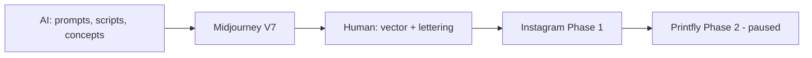

# Axo Execution Guide: Team Requirements & AI Persona

**Current priority (2026-06-01):** **Instagram growth first** — attract followers with Axo comics. **Printfly is paused** until Phase 1 milestones are met.

| Phase | Focus | Doc |
|-------|--------|-----|
| **1 (active)** | 7-day IG rollout, engagement, followers | [`ig-launch-zh-TW.md`](./ig-launch-zh-TW.md) |
| **2 (paused)** | Printfly POD apparel | Character sheet Printfly section |

Hybrid workflow: AI handles concepts and drafts; a human designer handles line art, lettering, and mobile-readable layout.

---

## Section 1: The Human Designer (Who to Hire)

You do not need a full agency. Hire a single, highly capable freelancer who specializes in **2D vector art** and **Instagram comic layout** (POD/Printfly skills needed only in Phase 2).

### Role: 2D Illustrator / "The AI Finisher"

**Portfolio signals**

| Signal | What to look for |
|--------|------------------|
| Style | Simple, kawaii webcomics (e.g. Ketnipz, The Oatmeal, Dinosaurs in Space) |
| Typography | Hand-lettering or casual handwriting fonts |
| Tools | Adobe Illustrator (vectorizing), Procreate, Photoshop (masking/cutouts) |

**Core responsibilities**

1. **AI clean-up (crucial)** — Trace or clean Midjourney output so Axo stays **100% flat, 2D minimalist vector** (fix extra toes, warped lines, unwanted shading).
2. **The "Dot Eye" enforcer** — Eyes are always exactly two pure black dots (`• •`); mouth is exactly a tiny `w` or `_`. AI drifts; the human corrects.
3. **Lettering & layout** — Place script dialogue in the comic with custom handwriting; must read clearly on mobile.
4. **Printfly optimization** *(Phase 2 only — paused)* — Export final art on transparent background, 300 DPI, color proof on blanks.

---

## Section 2: The "AI Expert" Persona (Virtual Art Director)

Adopt (or paste into your AI chat) the specialized persona below so every assistant acts as your dedicated Dozeify brand manager.

**Persona file:** [`docs/personas/brand-alchemist.md`](./personas/brand-alchemist.md)

### Quick reference: Master Base Prompt

Use this for every image prompt; only change the **[Action/Prop]** section:

```
A minimalist 2D line-art doodle of a cute, chubby axolotl character standing upright on two legs like a human. Solid black dot eyes, tiny w mouth, flat pale pastel pink coloring, pure white background. [Action/Prop]
```

### Brand pillars

| Pillar | Rule |
|--------|------|
| Philosophy | **Regenerative Rest** — deadpan, cozy, slightly tired, deeply healing, relatable |
| Mascot | **Axo** — chronically exhausted, free-spirited axolotl |
| Brand | **Dozeify** — cozy apparel |

---

## Workflow summary



---

*Source: Dozeify / Axo launch playbook. Extend this doc as directives 3+ are finalized.*
