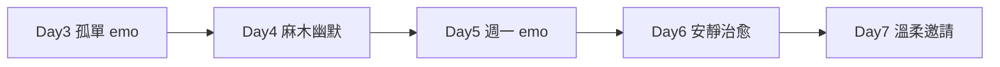

# Axo 7 日系列 · Day 3–7 內容計畫

**前提：** 手繪畫紙 · 小眼平嘴 · 外鰓 6 支完整 · 圖上字建議 **英文**（Caption 可繁英並用）  
**情緒線：** 呆 → 荒謬好笑 → **emo 共鳴** → 無力 → 溫柔收尾 → 邀請陪伴  

**已發／已規劃：** Day 1 介紹 · Day 2 發呆 · Day 2 輪播（很多事→午睡）

---

## 情緒弧線總覽



| 天 | 主情緒 | 共鳴點 |
|----|--------|--------|
| **3** | 😔 孤單、已讀不回 | 「不是生氣，是突然很空」 |
| **4** | 😶 麻木 | 「鬧鐘響了，靈魂沒醒」 |
| **5** | 🌧️ emo + 冷幽默 | 「存在，但不參與」 |
| **6** | 🫠 輕傷感→療癒 | 「至少杯子還在」 |
| **7** | 💜 溫柔 emo | 「如果你也空，可以留下」 |

---

## Day 3 — 想回但說不出（emo · 尷尬沉默）【新梗 · 統一版型】

### Axo 在做什麼
抱膝坐著，旁邊一個**空白對話框**；上中 **`........`**（像 Day 4 金魚那格）。不是已讀不回，是**打了又刪、最後什麼都沒傳**。

### 版型
左上 **Day 3** · 上中 **`........`** · 檔案 `axo-pen-day3.png`

### 繁中（Caption 用）
在輸入框打了又刪。最後只留一串點點。

### 畫面要素
| 必備 | 選配（加 emo） |
|------|----------------|
| 6 支外鰓 | 窗外細雨線（幾條即可） |
| 小眼平嘴 | 腳邊一小團影子（孤單感） |
| 坐姿、抱膝或垂手 | 無思考雲 |

### Caption 方向
```
不是生氣。
只是突然不知道要回什麼。

或者，其實什麼都不想回。

你今天也有已讀不回的時刻嗎？🫠
```

### Stories
投票：「你最常已讀不回誰？」→ 朋友 / 家人 / 工作群 / 所有人

### AI 場景提示（[Action]）
`sitting alone looking at phone, read receipt on screen, quiet sad emo mood, shoulders down, gills slightly drooping, no tears, rain optional`

---

## Day 4 — 鬧鐘沒醒（麻木 · 微酸）

### Axo 在做什麼
鬧鐘在旁邊畫出**震動線**或「叮——」，Axo **躺著或坐著**，眼睛仍是小點，表情空洞，完全沒動。幽默裡帶一點「人生好難起床」的 emo。

### 圖上字
**Alarm rang. I didn't.**

### 繁中
鬧鐘響了。我沒有。

### 畫面要素
鬧鐘道具、Axo 無反應、可蓋薄毯（延續睡覺世界觀）

### Caption 方向
```
鬧鐘：很努力。
我：也很努力（躺著）。

你今天起床了嗎？還是靈魂還在床上？🫠
```

### Stories
投票：「你按掉鬧鐘幾次？」→ 1 / 3 / 10+ / 沒起

### AI 場景
`alarm clock ringing beside axolotl who does not move, deadpan empty face, blanket, morning emo tired`

---

## Day 5 — 週一（emo · 存在但不參與）

### Axo 在做什麼
**雙腳站立**，但身體略側、像靈魂出竅。背景可極淡的「MON」或週一字樣（手寫）。外鰓下垂。可選：**一滴小雨** 在臉頰旁（不是哭，是氛圍）。

### 圖上字
**Monday: present, not participating.**

### 繁中
週一：人在，心沒來。

### 畫面要素
站姿、呆臉、**強調 emo 空氣**——周圍留白多

### Caption 方向
```
週一的我：
身體在開會。
心在睡覺。
靈魂在抗議。

這週的週一，你還好嗎？🫠
```

### Stories
問答：「用一個 emoji 形容你的週一」

### AI 場景
`standing but dissociating monday mood, emo empty, tiny rain drop optional, gills drooping, minimalist`

---

## Day 6 — 拿著杯子（輕 emo · 療癒）

### Axo 在做什麼
**站立**，雙手捧著杯子（或一杯水／熱飲），低頭看杯面。情緒：**有點難過，但安靜地照顧自己**。不是開心喝奶茶，是「至少還有這一杯」。

### 圖上字
**Today's plan: hold the cup.**

### 繁中
今天的計畫：抱著杯子。

### 畫面要素
參考 `axo-with-mug` 姿勢但表情更 soft emo；6 支外鰓；蒸氣細線

### Caption 方向
```
沒有完成什麼大事。
但有喝到一口水。
或一口熱的。

這樣，也算照顧了自己。🫠

你的今天，有好好喝一口嗎？
```

### Stories
投票：「你現在喝的是？」→ 水 / 咖啡 / 奶茶 / 沒喝

### AI 場景
`holding mug with both hands looking down, soft sad but self care emo, gentle, regenerative rest`

---

## Day 7 — 邀請留下（溫柔 emo · 收尾）

### Axo 在做什麼
**標準立姿**或**微微招手**（`axo-wave` 變體），表情仍平嘴小眼，但構圖溫暖。可選：腳邊一小塊影子兩個重疊（暗示「有我陪你」）。**不要**推銷。

### 圖上字
**If you're also doing nothing—stay.**

### 繁中
如果你也什麼都不想做——歡迎留下。

### 畫面要素
無思考雲；可選極淡粉紫水彩暈（溫暖，非喜慶）

### Caption 方向
```
這一週，Axo 什麼都沒做很多。
你可能也是。

如果你也需要一個
不用努力的角落——
追蹤一下。
我們一起發呆。🫠

—

謝謝你來。真的。
```

### Stories
投票：「要繼續看 Axo 嗎？」→ 要 / 當然 / 我已經是粉絲了

### AI 場景
`gentle wave or standing invite, warm emo hopeful, soft empty comfort, stay with us mood`

---

## 製圖檢查清單（每張）

- [ ] 畫紙底 `#F2EBD9`、水彩色 `#E8D8E8`
- [ ] 小眼 `r=2.5` 眼距寬 + 平嘴橫線
- [ ] 左 3 + 右 3 外鰓（趴/垂時可下垂，但 **6 支齊**）
- [ ] 4:5 · 1080×1350
- [ ] emo 日 **不誇張哭臉**（維持平嘴，用姿勢/雨/留白傳情）

---

## 檔案命名建議

| 天 | PNG 檔名 |
|----|----------|
| 3 | `axo-pen-day3-seen.png` |
| 4 | `axo-pen-day4-alarm.png` |
| 5 | `axo-pen-day5-monday.png` |
| 6 | `axo-pen-day6-cup.png` |
| 7 | `axo-pen-day7-stay.png` |

---

*搭配 [`ig-captions-zh-TW.md`](./ig-captions-zh-TW.md) 複製 Caption*
