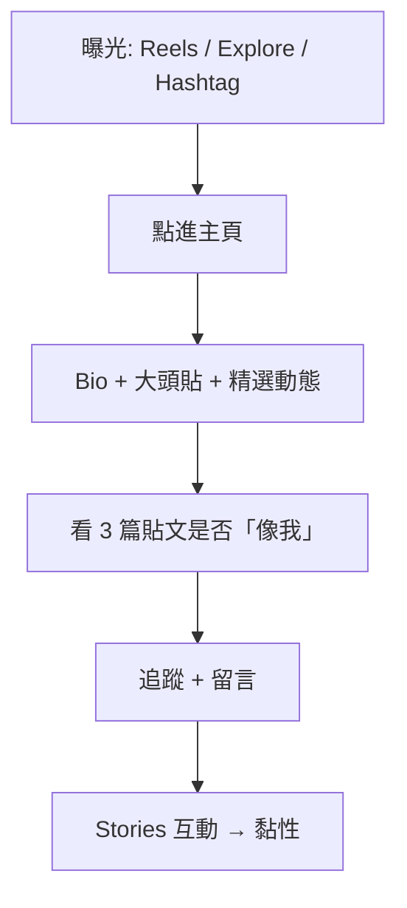

# Dozeify · Axo — 行銷策略總綱

**唯一首要目標（Phase 1）：** **吸引 Instagram 追蹤者（followers）**  
**暫不做：** 賣衣服、付費廣告（可選）、Printfly  

**品牌一句話：** Regenerative Rest — 用 Axo 的「呆」與「什麼都沒做」，讓人覺得被理解，而不是被催促。

---

## 一、策略定位

### 1.1 我們是誰

| 層次 | 內容 |
|------|------|
| **品牌** | Dozeify — cozy apparel（服飾 Phase 2 才上） |
| **吉祥物** | Axo — 慢性疲勞、自由靈魂的墨西哥鈍口螈 |
| **哲學** | Regenerative Rest（再生式休息） |
| **語氣** | Stupid cute、呆、心酸療癒、不 hustle |

### 1.2 目標受眾（IG）

| 族群 | 特徵 | 為何會追 |
|------|------|----------|
| **核心** | 18–32 歲、台港新馬、中英皆可 | 共感「累、不想動、發呆」 |
| **次要** | 上班族、學生、WFH | 需要「休息合法化」的梗圖 |
| **參考同溫層** | 追 Keigo、瑞秋廖、療癒梗圖帳 | 已習慣簡筆角色 + 一句話 |

### 1.3 競爭差異（不要模仿，要佔位）

| 他們 | 我們（Axo） |
|------|-------------|
| 勵志、正能量 | **休息是正當的** |
| 高飽和日系萌 | **手繪畫紙、小眼平嘴** |
| 複雜劇情漫畫 | **一圖一句，秒懂** |

---

## 二、漲粉漏斗（Instagram Organic）

### 各層打法

| 層級 | 手段 | KPI |
|------|------|-----|
| **曝光** | Reels 7–15 秒、輪播前 2 秒要「笑或呆」 | 觸及、非粉絲觸及 % |
| **主頁轉化** | Bio 清楚、精選 3 格、網格視覺一致（畫紙色） | 主頁瀏覽 → 追蹤率 |
| **共鳴** | 每篇一個可截圖金句 + 留言問題 | 儲存、分享 |
| **留存** | 連續系列（7 日、待辦→午睡） | 7 日回訪、Story 觀看 |

---

## 三、內容支柱（Content Pillars）

每週建議比例：

| 支柱 | 佔比 | 範例 |
|------|------|------|
| **① 發呆日常** | 40% | 什麼都沒做、靈魂離線、鬧鐘沒反應 |
| **② 再生式休息** | 25% | 休息不是偷懶、充電論 |
| **③ 待辦崩潰** | 20% | Day 2 輪播「很多事→午睡」 |
| **④ 社群互動** | 15% | 投票、問答、邀請分享你的 Thing 1 |

**視覺鐵律：** 鋼筆 × 畫紙、小眼平嘴、外鰓 6 支完整 — 見品牌資產文件。

---

## 四、渠道策略（Phase 1 只做 IG）

| 渠道 | 優先級 | 做法 |
|------|--------|------|
| **IG Feed** | ★★★ | 4:5 漫畫、輪播、每週 4–5 篇 |
| **IG Reels** | ★★★ | 漫畫圖 + 字淡入 + Lo-fi，每週 2 篇 |
| **IG Stories** | ★★☆ | 每日 1–3 格投票／幕後／轉發貼文 |
| **Threads** | ★☆☆ | 貼文一句話延伸，導流 IG |
| **小紅書** | 延後 | 粉絲 500+ 再考慮改尺寸 |
| **付費廣告** | 暫停 | 有 30 篇內容 + 明確受眾後再投 $5/天 測試 |

---

## 五、30 天漲粉節奏（概要）

| 週 | 主題 | 追蹤目標（新帳參考） |
|----|------|----------------------|
| **W0** | 開帳 + Post1 介紹 + Post2 發呆 | 帳號上線 |
| **W1** | 7 日系列發完 + 每日 Stories | +30～80 |
| **W2** | Reels 為主 + 同溫層互動加倍 | +50～120 |
| **W3** | 輪播精選 + UGC 邀請（「你的午睡圖」） | +80～150 |
| **W4** | 本月語錄回顧 + 明確追蹤 CTA | 累計 **200～500** |

> 數字依內容品質與互動而定；**連續 14 天發文**比單日爆款更重要。

詳細每日表：[`action-plan-zh-TW.md`](./action-plan-zh-TW.md)

---

## 六、Hashtag 策略

### 固定組（每篇貼 5–8 個）

**品牌：** `#Dozeify` `#Axo`  
**主題：** `#再生式休息` `#躺平也可以` `#發呆` `#療癒漫畫`  
**流量（中小）：** `#什麼都沒做` `#休息很重要` `#治癒系` `#插畫日常`

### 規則

- 禁止只堆百萬級標籤（#love #instagood）  
- 每 3 天換 1–2 個「流量標籤」做 A/B  
- 英文帖可加 `#regenerativerest` `#cozycomics`

---

## 七、互動與社群（每日 20 分鐘）

| 時段 | 動作 |
|------|------|
| 發文後 30 分鐘 | 回覆每則留言；在貼文下自留言英文/繁中各一句 |
| 每日 | 同溫層帳號 **真誠留言 5 則**（非「來看看我」） |
| 每週 | 合作轉發 1 位小創作者（互轉 Stories） |
| Stories | 投票、問答箱、「你今天 Thing 1 是什麼」 |

**回覆人設（Axo 口吻）：** 短、呆、溫柔。例：「嗯。」「Axo 也在躺。」「今天允許不做。」

---

## 八、Reels 簡易 SOP（無需動畫師）

1. 選一張已發或將發的 4:5 漫畫  
2. CapCut／Canva： Ken Burns 微放大 + 手寫字 0.5 秒淡入  
3. 音樂：Lo-fi / 環境音，音量 15%  
4. 封面：Axo 大臉 + 繁中或英一句（可讀）  
5. Caption 與 Feed 相同 + `#reels`

**腳本範例（7 秒）：** 畫面停留 → 字「Thing 1: Nap.」淡入 → 輕「咚」一聲結束  

---

## 九、KPI 儀表板（每週日檢查）

| 指標 | 工具 | W1 參考 |
|------|------|---------|
| 追蹤數 | IG 洞察 | 趨勢 ↑ |
| 觸及（非追蹤） | 洞察 | > 追蹤數 3× |
| 儲存數 | 單篇 | 高於讚數 = 金句成功 |
| 分享數 | 單篇 | 輪播、發呆帖通常較高 |
| 留言數 | 單篇 | 有問答題 > 無問答 |
| Profile 點擊 | 洞察 | Reels 帶動 |

**Phase 2 開店門檻（維持）：** 14 天連更 · 500 追蹤或 5k Reels 播放 · ≥5 則「哪裡買」

---

## 十、風險與禁忌

| 不要做 | 原因 |
|--------|------|
| 一開始就賣衣服 | 信任未建立 |
| 風格漂移（向量/厚塗） | 品牌辨識崩潰 |
| 外鰓畫不全 | 粉絲會覺得「不是 Axo」 |
| 買粉、刷讚 | 洞察失真、無轉換 |
| 長文说教 | 與「呆」人設衝突 |

---

## 十一、相關文件索引

| 文件 | 用途 |
|------|------|
| [`action-plan-zh-TW.md`](./action-plan-zh-TW.md) | **每日執行清單** |
| [`ig-launch-zh-TW.md`](./ig-launch-zh-TW.md) | 開帳、7 日腳本 |
| [`ig-captions-zh-TW.md`](./ig-captions-zh-TW.md) | 貼文 Caption |
| [`ig-day2-comic-zh-TW.md`](./ig-day2-comic-zh-TW.md) | Day 2 輪播 |
| [`roadmap-zh-TW.md`](./roadmap-zh-TW.md) | 階段路線圖 |

---

*版本：2026-06-02 · Phase 1 = Followers First*
