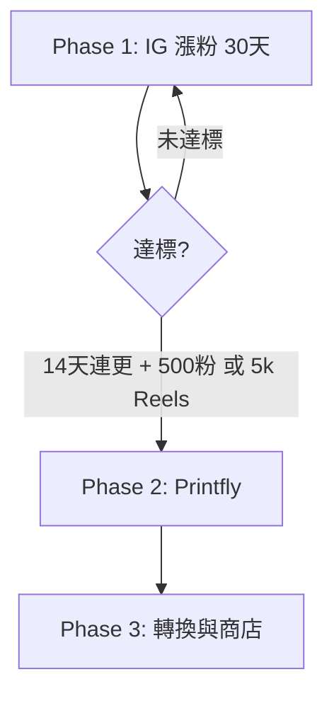

# Dozeify 路線圖

**North Star（Phase 1）：** **吸引 Instagram 追蹤者**

| Phase | 目標 | 關鍵產出 | 文件 |
|-------|------|----------|------|
| **1 — 現在** | **吸粉、互動、品牌辨識** | Feed、Reels、Stories、輪播 | [`marketing-strategy-zh-TW.md`](./marketing-strategy-zh-TW.md) · [`action-plan-zh-TW.md`](./action-plan-zh-TW.md) |
| **2 — 暫停** | POD 上架 | 胸印、試色 | `axo-character-sheet` Printfly 段 |
| **3 — 未來** | 粉絲 → 顧客 | 官網、預購 | TBD |

## Phase 1 成功標準

| 指標 | 門檻 |
|------|------|
| 連續發文 | **14 天** |
| 追蹤 | **500+** *或* |
| Reels | 單支 **5,000+** 播放 |
| 購買意圖 | 留言「哪裡買」≥ **5**（開 Phase 2 訊號） |

## 本週立即做

見 [`action-plan-zh-TW.md`](./action-plan-zh-TW.md) → Week 0 / Week 1 勾選表。
